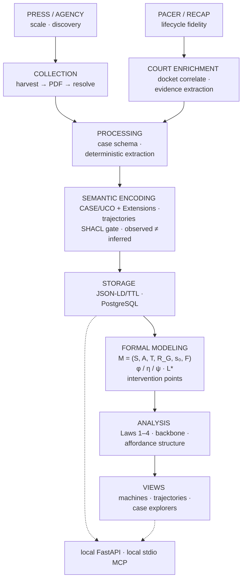
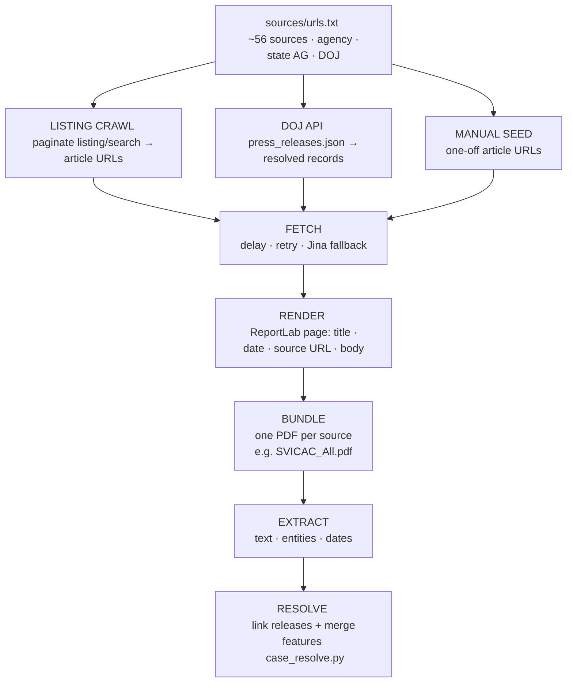

# CaseNoesis

**CaseNoesis** aggregates, structures, and decomposes case data across offense types, modeling exploitation as state machines and Markov decision processes to understand how platform affordances are misused, how crime types evolve alongside technology, and where intervention is possible.

## Origin & Framework

The theoretical foundation for this project is **["Affordances for Harm: How Offenders Misuse Platform Capabilities to Exploit Children, and Where to Intervene"](https://doi.org/10.5281/zenodo.21347781)**

AfH develops a formal affordance–misuse–harm framework (φ/η/ψ mapping) and validates it against a corpus of ICAC enforcement cases. CaseNoesis is the empirical test of whether that framework generalizes across offense types beyond the one it was originally derived from.

## Scope

- Multi-offense ingestion (fraud, trafficking, cyber-enabled crime, CSEA/ICAC)
- **Local-machine** collector (`collector/`) plus local stdio MCP to orchestrate it (`casenoesis_mcp`)
- Website/docs may run on Railway. There is **no public MCP**. CaseLinker remains the public ICAC collector and query API.
- Local FastAPI + sqlite for the researcher site and corpus tools (`python3 run/main.py`)

## Status

The collector, the press lookup, and the CourtListener link manifest are in this repo. Ingestion architecture and offense-category taxonomy are under active development. No public data release yet.

## Architecture

The pipeline turns public enforcement records into structured features, knowledge graphs, and state machines. Full design: [`Architecture design.md`](Architecture%20design.md).

**Two source jobs.** Press and agency releases give **scale**. PACER charging docs give **lifecycle fidelity** for grounding machines. Collection and enrichment are separate paths that meet at processing — see [Collection](#collection) and [Court records & enrichment](#court-records--enrichment).

**Cross domain analysis.** Processing extracts comparable features under a domain-agnostic offense record (domain profiles specialize; they do not redefine the core). Graphs are CASE/UCO + Extensions with the trajectories metamodel; SHACL is a publish gate, and inferred analytics are never typed as observed facts.

**What the system is for.** The primary purpose is to build formal models, specifically the *Exploitation State Machine*. Analysis tests Theorem 1 and Laws 1–4 across domains, annotates affordances, and *ranks intervention points*. The local website and stdio MCP expose machines and collection tools to the researcher — not to the public internet. CaseLinker remains the public ICAC collector and query API.

## Collection

CaseNoesis is primarily built from public press releases — agency newsrooms, state attorney general offices, DOJ and its U.S. Attorney districts. Nothing behind a login, nothing paywalled. Every record traces back to a URL anyone can open.

### The pipeline, in one picture

Scrape tools live under [`collector/`](collector/README.md). The pipeline is the same whether you run those scripts on the CLI or an agent calls them through local MCP ([`casenoesis_mcp/`](casenoesis_mcp/README.md), stdio only). Outputs land in [`data/collected/`](data/collected/README.md) and do not auto-ingest.

### How a press release becomes a case

1. **Discover.** Each source is a listing page the crawler paginates, a DOJ API lookup for `justice.gov` URLs, or a hand-supplied URL. Output is always the same: article URLs (or already-resolved DOJ records).
2. **Fetch.** Pages are pulled with spaced requests; failures retry and can fall back to Jina Reader when a host blocks direct HTML.
3. **Render.** Content is laid out into a structured PDF page (title, publication date, canonical source URL, body).
4. **Bundle.** Pages merge into one PDF per source, so a source is one reviewable artifact.
5. **Extract.** Ingestion splits the bundle on `Source:` lines and pulls text, entities, and dates. One URL → one document row.
6. **Resolve.** Related case releases (indictment / plea / sentencing) collapse to one canonical case. Features are **combined** across those releases (OR/union for platforms, agencies, statutes, topics; AND-check for docket / defendant / district; later lifecycle wins for plea/sentence). Every source URL is kept. Match order: docket → district + defendants → soft review. Whiteprint: [`case_resolve.py`](src/Processing%20Layer/case_resolve.py).

### Source types

| Type | What it covers | Notes |
|------|----------------|-------|
| DOJ API | Federal / USAO `justice.gov` releases | Structured JSON; used because live pages are bot-walled |
| Federal agency | USMS, USSS, HSI, and similar newsrooms | Templated sites; host extractors + Jina when needed |
| State AG | State-level prosecutions | Highest HTML variation |
| Task force / local | ICAC and specialized task forces, local PDs | Thin alone, wide in aggregate |

### What counts as a case

A case often generates several releases over its life — indictment, plea, sentencing — and a coordinated operation may be announced by DOJ, a U.S. Attorney’s office, and a state AG on the same day.

Collection keeps documents and cases distinct. Counts are not interchangeable:

| Level | Meaning |
|-------|---------|
| Documents | Press releases retrieved (one `Source:` URL each) |
| Cases | Canonical prosecutions after resolve (one or more documents) |
| Defendants | Individuals named across those cases |

### Current state

| | |
|--|--|
| Sources bundled (ICAC lineage) | 56 |
| Bundled pages | 4,860 |
| Largest bundle | `SCAG_ICAC_All.pdf` — 633 pages |
| NHSR #8252 harvest | Press lookup for 13,047 releases, and a CourtListener link manifest for 500+ free RECAP filings (trafficking and forced labor). Article text and PDFs are local only. |

The collection layer is crime-type agnostic. A new topic is a new profile (`title_terms`, `court_queries`), not a new pipeline. Bulk collection runs through `collector/run_bulk.py`.

## Court records & enrichment

Press releases are the discovery surface. Federal **PACER** filings (and free **CourtListener / RECAP** copies when available) are the supplementing sources including: indictments, superseding indictments, statements of offense, plea agreements, sentencing memoranda, docket sheets.

**Free RECAP collection** is part of the same collector: `collector/court_records.py` writes unpaid PDFs to [`data/collected/recap/`](data/collected/README.md). Never PACER from that path.

Court records **enrich** a press-release case already resolved in collection:

1. **Locate** — from a selected case, find the federal docket (district + case number when the release prints it; otherwise defendant + venue heuristics).
2. **Retrieve** — pull the filing PDFs (RECAP first; PACER purchase only when needed and authorized).
3. **Extract** — pull structured facts from each filing type (charges and counts from the indictment; factual narrative from the statement of offense; disposition and sentence from plea / judgment).
4. **Correlate** — attach filings to the same `prosecution_id` as the press releases (docket is the hard key; link press release and court records).
5. **Enrich** — merge court-extracted facts into the canonical case the same way *resolve* merges press releases (OR/union for charges, platforms, co-defendants; court filing wins on statute text and formal disposition when both exist). Court record provenance over press-release extracted features.

Paid-PACER scaffolding lives under [`collector/pacer/`](collector/pacer/). Filings and facts stay in [`data/collected/PACER/`](data/collected/PACER/). Document-type extraction and the enrich path (step 3–5) are being rebuilt with the rest of processing — not production-ready yet.

### State open records

Where a federal docket is thin or the matter is state-charged, **public records requests** can supply the same kind of enriching metadata — charging instruments, dispositions, affidavits — if the request is approved and the records are releasable:

| Mechanism | Scope |
|-----------|--------|
| Federal FOIA | Federal agency records (not a substitute for PACER court filings) |
| Georgia Open Records Act | State and local agency records in Georgia |
| Florida Public Records Law (Ch. 119) | State and local agency records in Florida |

These are **opt-in enrichment channels**, not scrapers. Nothing is collected under them until the request is lawful, approved where required, and logged with provenance like every other document.

## Local MCP & orchestration

The collector is unchanged. Local MCP is how an agent on this machine drives those same scripts. It is **stdio-only** (`python -m casenoesis_mcp.server`). It is not mounted on Railway. Cursor config: [`.cursor/mcp.json`](.cursor/mcp.json) (see [`casenoesis_mcp/mcp.json.example`](casenoesis_mcp/mcp.json.example)).

| Job | How |
|-----|-----|
| Fill a quota (hundreds–thousands) | CLI: `python3 collector/run_bulk.py --press-count 1000 --court-count 50` |
| One more record from domain profiles | MCP `collect_record` (or `run_bulk.py --one`) |
| Small agent batch | MCP `collect_bulk` (default 1 press / 0 court so the client does not time out) |
| Known press URL | MCP `probe_press_url` → `resolve_press_urls` → `build_press_pdf` |
| Known free court filing | MCP `search_courtlistener` → `list_free_recap_documents` → `download_free_recap` |

WRITE tools write under `data/collected/` and do **not** ingest into sqlite. Collector tools do not need FastAPI. Corpus/graph/triage tools do: `python3 run/main.py` on localhost.

Tool catalog: [`casenoesis_mcp/README.md`](casenoesis_mcp/README.md) and [`casenoesis_mcp/tool_registry.md`](casenoesis_mcp/tool_registry.md). Engine: [`collector/README.md`](collector/README.md).

## Data & Ethics

Case data is drawn exclusively from publicly available enforcement records (press releases, court filings already in the public domain) and from open-records releases obtained through lawful request. CaseNoesis public-record collection is completed in accordance with **[UMass HRPO NHSR #8252](docs/ethics/NHSR_8252.md)** (16 Sep 2026). 

## Contributing

Contributors can help by:
- Proposing offense categories and taxonomy structure
- Ingestion pipeline design for new offense categories
- Code implementation

---

*CaseNoesis builds on ideas developed in [CaseLinker](https://github.com/mrinaalr/CaseLinker), a CSEA-focused case analysis platform. The relationship is one of shared DNA, not shared codebase. CaseNoesis's ingestion and processing layers are being built independently for cross-domain use.*