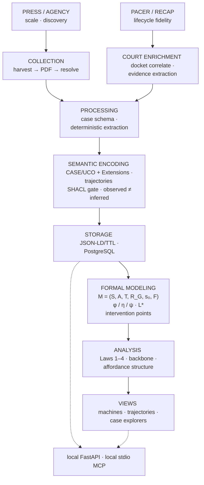

# CaseNoesis

**CaseNoesis** aggregates, structures, and decomposes case data across offense types, modeling exploitation as state machines and Markov decision processes to understand how platform affordances are misused, how crime types evolve alongside technology, and where intervention is possible.

## Origin & Framework

The theoretical foundation for this project is **["Affordances for Harm: How Offenders Misuse Platform Capabilities to Exploit Children, and Where to Intervene"](https://doi.org/10.5281/zenodo.21347781)**

AfH develops a formal affordance–misuse–harm framework (φ/η/ψ mapping) and validates it against a corpus of ICAC enforcement cases. CaseNoesis is the empirical test of whether that framework generalizes across offense types beyond the one it was originally derived from.

## Scope

- Multi-offense ingestion (fraud, trafficking, cyber-enabled crime, ICAC/CSEA)
- **Local-machine** collector (`collector/`) plus local stdio MCP to orchestrate it (`casenoesis_mcp`)
- Website/docs may run on Railway. There is **no public MCP**. CaseLinker remains the public ICAC collector and query API.
- Local FastAPI + sqlite for the researcher site and corpus tools (`python3 run/main.py`)

## Status

The collector and the public lookups (`data/collected/public/`) are in this repo. Ingestion architecture and offense-category taxonomy are under active development. No public data release yet.

## Architecture

The pipeline turns public enforcement records into structured features, knowledge graphs, and state machines. Full design: [`Architecture design.md`](Architecture%20design.md).

```mermaid
flowchart TD
    P["PRESS / AGENCY <br/> scale · discovery"]
    C["PACER / RECAP <br/> lifecycle fidelity"]

    P --> ACQ["COLLECTION <br/> harvest → PDF → resolve"]
    C --> ENR["COURT ENRICHMENT <br/> docket correlate · evidence extraction"]

    ACQ --> PROC["PROCESSING <br/> case schema · <br/> deterministic extraction"]
    ENR --> PROC

    PROC --> ENC["SEMANTIC ENCODING <br/> CASE/UCO + Extensions · trajectories <br/> SHACL gate · observed ≠ inferred"]
    ENC --> STORE["STORAGE <br/> JSON-LD/TTL · PostgreSQL"]

    STORE --> ESM["FORMAL MODELING <br/> M = (S, A, T, R_G, s₀, F) <br/> φ / η / ψ · L* <br/> intervention points"]
    ESM --> AN["ANALYSIS <br/> Laws 1–4 · backbone · affordance structure"]
    AN --> VIZ["VIEWS <br/> machines · trajectories · case explorers"]

    STORE -.-> API["local FastAPI · local stdio MCP"]
    VIZ -.-> API
```

**Three collection paths.** Press for scale. Free RECAP for court filings; PACER only with a spend cap. Reference records for platform rules, statutes, and calibration. They meet at processing. See [Collection](#collection).

**Cross domain analysis.** Processing extracts comparable features under a domain-agnostic offense record (domain profiles specialize; they do not redefine the core). Graphs are CASE/UCO + Extensions with the trajectories metamodel; SHACL is a publish gate, and inferred analytics are never typed as observed facts.

**What the system is for.** The primary purpose is to build formal models, specifically the *Exploitation State Machine*. Analysis tests Theorem 1 and Laws 1–4 across domains, annotates affordances, and *ranks intervention points*. The local website and stdio MCP expose machines and collection tools to the researcher — not to the public internet. CaseLinker remains the public ICAC collector and query API.

## Collection

Collection tools live under [`collector/`](collector/README.md). The pipeline is the same whether you run those scripts on the CLI or an agent calls them through local MCP ([`casenoesis_mcp/`](casenoesis_mcp/README.md), stdio only). Outputs land in [`data/collected/`](data/collected/README.md) and do not auto-ingest.

Press, free court records, and reference records are the three paths. A new topic is a profile, not a new pipeline. The public index is `data/collected/public/*_lookup.jsonl`: one row per record, no article text, no PDF path. Article text and PDFs stay on the machine. To fetch those rows again: `python3 -m collector.reproduce`.

Court filings enrich a press case. Search is CourtListener. Download is a filing already in free RECAP. PACER is the paid backup under [`collector/pacer/`](collector/pacer/), and only with a spend cap. State open-records requests (FOIA, Georgia, Florida) are opt-in and are not scrapers.

Local MCP is stdio only (`python -m casenoesis_mcp.server`). It is not on Railway. Tool catalog: [`casenoesis_mcp/tool_registry.md`](casenoesis_mcp/tool_registry.md). Corpus tools need `python3 run/main.py`. Collector tools do not.

## Data & Ethics

Case data is drawn exclusively from publicly available enforcement records (press releases, court filings already in the public domain) and from open-records releases obtained through lawful request. CaseNoesis public-record collection is completed in accordance with **[UMass HRPO NHSR #8252](docs/ethics/NHSR_8252.md)** (16 Sep 2026). 

## Contributing

Contributors can help by:
- Proposing offense categories and taxonomy structure
- Ingestion pipeline design for new offense categories
- Code implementation

---

*CaseNoesis builds on ideas developed in [CaseLinker](https://github.com/mrinaalr/CaseLinker), a CSEA-focused case analysis platform. The relationship is one of shared DNA, not shared codebase. CaseNoesis's ingestion and processing layers are being built independently for cross-domain use.*