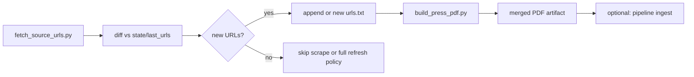

# Press release → structured PDF (collector guide)

This document is for **agents and humans** who add or refresh **press-release sources** for **CaseNoesis** (ported from CaseLinker). It covers:

**listing/search page or DOJ API → article records → per-article PDFs → one merged PDF**

The PDF engine is **topic-agnostic**. ICAC listing queries (`child sexual`) and `verify_cac.py` are filters for the CAC corpus, not a limit on what `build_press_pdf.py` will convert. Any public press release (DOJ, USAO, state AG, sheriff, ICE, …) uses the same layout.

---

## Press release sources

Every article in the merged PDF must be a **self-contained press-release page** with a predictable header block:

1. **Title** (headline)
2. **Byline** (optional human date under the title)
3. **`Publication date: YYYY-MM-DD`** (when we can resolve it - helps downstream year assignment)
4. **`Source: https://…`** (canonical article URL - **required**; downstream splitting keys off this line)
5. **Body** (paragraphs of the release, not site chrome)

`build_press_pdf.py` builds that layout with ReportLab and merges pages with `pypdf`. Generic HTML works for many sites; some hosts need **host-specific extractors** in `extract()` or Jina cleanup in `extract_from_jina_reader()`.

### justice.gov (DOJ) - API route, not scraping

`www.justice.gov/usao-*/pr/*` and `/archives/opa/pr/*` sit behind an **Akamai Bot Manager JS interstitial** (a proof-of-work challenge page, not the article - confirmed host-wide across multiple USAOs, not specific to one release). Direct `requests`/`curl` gets back a ~2.4KB challenge shell instead of content. Jina Reader (`r.jina.ai`) can *also* independently refuse anonymous requests on network-reputation grounds, unrelated to Akamai. **Do not try to solve the JS challenge** - that is bot-wall evasion, not scraping, and this repo does not do that.

Instead, DOJ publishes a public press-release API that needs no bot-wall workaround:

- `GET https://www.justice.gov/api/v1/press_releases.json?parameters[title]=<substring>&pagesize=50&page=N`
- Docs: `https://www.justice.gov/developer/api-documentation/api_v1`
- `parameters[title]` does a **substring** match against the title - not exact/quoted, despite how the docs example reads
- `page=` and `pagesize=` are **top-level** query params, *not* nested under `parameters[...]`
- Rate limit per the docs: **4 requests/second** (`harvest_doj_press.py` and `resolve_press_urls.py` self-throttle to ~3 req/s)
- No API key required
- `parameters[topic]`, `body`, and `component` **do nothing** - title + date only. Confirm with a `pagesize=1` count before a long harvest.
- Title `"Project Safe Childhood"` is ~87 hits (mostly quarterly rollups). Most PSC prosecutions hide the phrase in the **body** footer.
- `justice.gov/psc/press-room` is a curated listing (~12/page) but **page>0 returns HTTP 403**. Do not crawl it.
- The `body` field is raw HTML - `<p>` blocks, `&nbsp;`, embedded `<a>`/`<br>`, and sometimes an addendum `<table>` (defendant / role / charges / status rows). A naive "grab all `<p>` text" strip silently **drops the table**. `resolve_press_urls.py`'s `clean_doj_api_body()` walks `<p>` and `<tr>` in document order so table rows survive as their own line.

There is **no** “search by URL” parameter. Two tools, two jobs - do not mix them up:

| Job | Tool | What it does |
|-----|------|----------------|
| Discover records by topic | `harvest_doj_press.py` | Pages each `--title-term` newest-first until `--max-keep` or the resultset ends. Filters. Writes `--doj-file` JSON. |
| Resolve URLs you already have | `resolve_press_urls.py` | For each `justice.gov` URL: derive slug keywords, query title, **exact slug match**. Max **6 pages (300 hits)** per URL - enough for lookup, not for a 14k title crawl. |

Do not call the API from a one-off `urllib` script unless you are probing a count (`pagesize=1`). Harvest and resolve already exist.

### `harvest_doj_press.py` - DOJ discovery (PSC recipe, any topic)

Defaults keep Project Safe Childhood prosecutions (CAC title terms, PSC in title/body, drop grants/rollups, sentencing over plea, `verify_cac.py`). Override flags for the next PSC batch or a different crime type.

```bash
cd collector

# Smoke
python3 harvest_doj_press.py --limit-pages 1 --max-keep 20

# Another 2,000+ PSC records (no cap; skip URLs already in the merged PDF)
python3 harvest_doj_press.py --max-keep 0 --baseline-pdf ../../DOJ_SAFE_CHILDHOOD.pdf
python3 build_press_pdf.py --doj-file sources/doj_psc_resolved_novel.json \
  --out-dir ../.. --out-name DOJ_SAFE_CHILDHOOD_MORE.pdf

# DOJ drugs / any other title universe - same PDF path, no CAC gate
python3 harvest_doj_press.py --slug doj_fentanyl --skip-cac \
  --require 'fentanyl' --title-term fentanyl --title-term 'controlled substance' \
  --max-keep 2200
python3 build_press_pdf.py --doj-file sources/doj_fentanyl_resolved_novel.json \
  --out-dir ../.. --out-name DOJ_FENTANYL_All.pdf
```

Useful flags: `--title-term` (repeatable; replaces built-in CAC phrasing), `--require` (regex on title+body), `--skip-cac`, `--keep-early` (keep arrest/indictment titles), `--slug` (output prefix), `--source` (label on CAC-gate probes), `--baseline-pdf` (repeatable extra novelty PDF), `--max-keep 0` (exhaust the paged terms).

Novelty is **URL vs existing DOJ PDFs** (`DOJ_CEOS_All.pdf`, `DOJ_ARCHIVES_All.pdf`, `DOJ_AI_CSAM_All.pdf`, `DOJ_SAFE_CHILDHOOD.pdf`, plus `--baseline-pdf`). Use `*_resolved_novel.json` for the PDF. Dedup inside the harvest is by API `uuid`. This is **not** unique-offender identity.

`--max-keep` counts **kept** records, newest first. The first PSC ingest capped at 2,200 (2,192 novel vs then-existing DOJ PDFs). Raising/removing the cap is how you pull older years.

After the PDF: wire a new source like CEOS (`ingestion.py`, `batching.py`, `src/main.py` `DOJ_SOURCES`, `agency_context_gate.py`, `visualization/sources.html`) if it is a new CaseLinker source key. Reuse `DOJ SAFE CHILDHOOD` only when appending more PSC.

---

## Prerequisites

From repo root (or `collector/`):

```bash
pip install requests beautifulsoup4 reportlab pypdf pdfplumber
```

Optional but useful: `curl` for quick HTML probes without running Python.

---

## Canonical workflow (new source)

Do these steps **in order**. Do not skip verification.

### 1. Find the listing surface

Identify where the agency publishes what you care about:

| Pattern | Examples |
|--------|----------|
| **DOJ News API** (no HTML listing) | `harvest_doj_press.py` - see justice.gov section above |
| Site search `?s=…` / `?q=…` | Osceola `?s=ICAC`, Iowa DPS `?q=ICAC` |
| Dedicated news index | `/news/`, `/media-relations/`, `/press-releases/` |
| Paginated search template | `…&page={page}`, `start=0,20,40`, `start_rank=1:91:10` |
| Squarespace search | HTML search page + `/api/search/GeneralSearch?q=…&p=…` |
| Google Programmable Search (CSE) | Widget on `/search?goog=…#gsc.q=…` - static HTML has no hits; use `--google-cse-search-page` (Jina + sitemap slug resolve) |
| Drupal / WordPress search | `search/node?keys=…&page={page}` |

**Topic is not limited to ICAC.** Use keywords that match the future CaseLinker domain (e.g. `trafficking`, `human trafficking`, `CSAM`, task force name, statute language the agency uses in headlines).

### 2. Verify one article in the browser

Open **one** result link. Confirm:

- The page is a **real press release** (not a program overview, award, newsletter index, or search page).
- Body text is substantial (roughly **≥ 80 characters** after stripping nav - that is `MIN_BODY_CHARS` in `build_press_pdf.py`).
- You can see a plausible **publication date** (meta tag, visible dateline, or URL path like `/2024/03/15/`).

If the listing mixes good and bad links, you will filter with **require/exclude substrings** when harvesting URLs (step 3), not by hoping scrape fixes it.

### 3. Harvest article URLs

**Option A - `fetch_source_urls.py`** (preferred when many pages share one listing pattern):

```bash
cd collector

# Single search / listing page
python3 fetch_source_urls.py \
  --url 'https://www.example.gov/search?q=trafficking' \
  --same-host \
  --path-prefix /news/ \
  --require-any trafficking \
  --exclude /search --exclude /tag/ --exclude /feed/ \
  -o sources/example_trafficking_urls.txt

# Paginated template (inclusive range)
python3 fetch_source_urls.py \
  --url-template 'https://www.example.gov/search?page={page}&q=ICAC' \
  --page-range 0:5 \
  --same-host \
  --path-prefix /press/ \
  -o sources/example_icac_urls.txt
```

**Option B - manual `urls.txt`** (preferred for small, curated sets or after manual cleanup):

- One `https://` URL per line
- Lines starting with `#` are comments
- Order is preserved in the merged PDF

Put working lists under `collector/sources/<agency>_<topic>_urls.txt` (create `sources/` as needed). Keep a short-lived `urls.txt` only when you are about to run `build_press_pdf.py` in one shot.

**Harvest hygiene (always):**

- Exclude: `/search`, `?s=`, `/page/`, `/tag/`, `/category/`, `/feed/`, `rss`, `wp-content`, login, newsletter shells.
- Require (when needed): topic tokens in the path or slug (`trafficking`, `icac`, `arrest`, `csam`, etc.).
- Deduplicate: same article with/without trailing slash - normalize to one form.
- Open 2-3 random URLs from the file before scraping the full list.

**`fetch_source_urls.py` toolbox:**

| Flag | Use when |
|------|----------|
| `--same-host` | Drop off-domain links |
| `--also-host` | Allow CDN or second domain (repeatable) |
| `--path-prefix` | Only paths under `/news/` etc. |
| `--require-any` / `--require-any-from FILE` | URL must contain one substring |
| `--exclude` / `--exclude-from FILE` | Drop listing/tag/feed URLs |
| `--stop-if-text` | Stop pagination when “no results” appears |
| `--url-template` + `--page-range` | Numeric pages (`0:29` or stepped `1:91:10`) |
| `--raw-url-regex` | URLs only in JSON-LD / Search.gov HTML |
| `--squarespace-search-page` | Anchorage-style Squarespace search API |
| `--google-cse-search-page` | Google CSE listing (e.g. USSS `search?goog=ICAC#gsc.q=ICAC&gsc.page=1`) |
| `--cse-sitemap` | Sitemap for expanding truncated CSE slugs (defaults to `{host}/sitemap.xml`) |
| `--cse-max-results` | Cap harvest count after filters |
| `--insecure` | Broken TLS chain on government host |
| `--allow-http` | Rare legacy http links |

### 4. Probe extract on one URL (before full batch)

```bash
cd collector
python3 - <<'PY'
import importlib.util, subprocess
from pathlib import Path

spec = importlib.util.spec_from_file_location("build_press_pdf", "build_press_pdf.py")
mod = importlib.util.module_from_spec(spec)
spec.loader.exec_module(mod)

url = "https://www.example.gov/one-article/"
html = subprocess.run(
    ["curl", "-sS", "-L", "-A", "Mozilla/5.0", url],
    capture_output=True, text=True, check=True,
).stdout
r = mod.extract(html, url)
if r:
    title, byline, body, pub = r
    print("title:", title[:80])
    print("byline:", byline)
    print("pub:", pub)
    print("body chars:", len(body))
    print("body preview:", body[:400])
else:
    print("extract returned None (body too thin or no container)")
PY
```

**Healthy signals:** title looks like the headline (not site name), `body chars` well above 80, preview reads like a press release.

**Unhealthy signals:** nav menus, cookie banners, “Search results”, duplicate columns, empty body → fix extractors (see Troubleshooting) before scraping hundreds of URLs.

### 5. Build the merged PDF

```bash
cd collector

python3 build_press_pdf.py \
  --url-file sources/example_trafficking_urls.txt \
  --out-dir ../.. \
  --out-name EXAMPLE_TRAFFICKING_All.pdf \
  --insecure \
  --jina-fallback
```

| Flag | When |
|------|------|
| `--limit 5` | Smoke-test first 5 URLs |
| `--delay 1.5` | Polite rate limit (default ~1.2s between URLs) |
| `--referer 'https://www.example.gov/'` | Hotlink or WAF issues |
| `--insecure` | TLS verification failures on .gov hosts |
| `--jina-fallback` | 403 to bots, or direct HTML extract is thin |

**Output:** `{out-dir}/{out-name}` plus per-URL cache under `{out-dir}/tmp/`.

**Cache behavior:** Each URL is cached as `tmp/{index:04d}_{sha256(url)[:16]}.pdf`. Re-runs skip download if cache file exists and is > 500 bytes. **Important:** cache is keyed by URL hash, not slot number - safe when you switch `url-file` between agencies. To force refresh, delete `tmp/` or specific cache files.

### 6. QA the merged PDF

Open the merged file and spot-check:

- [ ] One article per section, each with **`Source: https://`**
- [ ] Titles differ per article (not all “Media Relations” or site masthead)
- [ ] Bodies are release text, not footers/sidebars
- [ ] `Publication date:` present when the site exposes a date
- [ ] Page count ≈ number of URLs (minus failures printed at end)

Read the console summary: `Succeeded: N | Failed: M`. Investigate every failed URL.

---

## `resolve_press_urls.py` - DOJ API bridge (run before `build_press_pdf.py` when the source list may contain justice.gov URLs)

If a url-file mixes `justice.gov` URLs with state AG / other self-hosted sources, run `resolve_press_urls.py` **first** instead of feeding the url-file straight to `build_press_pdf.py`:

```bash
cd collector
python3 resolve_press_urls.py --url-file sources/urls.txt --out sources/urls_resolved.json
```

For each URL, it classifies and routes:

- **`justice.gov`** → resolved via the DOJ API (see above), never fetched live. Emits `{"source_url", "mode": "resolved", "title", "byline", "pub_date", "body", "agency", "uuid"}` - `body` is already clean paragraph text, ready for `write_pdf()`.
- **anything else** → passed through unchanged: `{"source_url", "mode": "scrape"}`. **No behavior change** for state AG / other existing sources - `build_press_pdf.py` fetches and extracts these exactly as it always has.
- **no exact API match found** for a `justice.gov` URL → `{"source_url", "mode": "unresolved"}`. `build_press_pdf.py` counts these as failures rather than guessing at a fetch that will just hit the Akamai wall.

Then feed the output into `build_press_pdf.py` with `--doj-file` instead of `--url-file`:

```bash
python3 build_press_pdf.py --doj-file sources/urls_resolved.json \
  --out-dir ../.. --out-name MIXED_BATCH_All.pdf
```

`--doj-file` takes precedence over `--url-file` when both are given. `mode: "resolved"` records skip network entirely and go straight to `write_pdf()` (no rate-limit delay applied - no request was made). `mode: "scrape"` records run through the same `resolve_url_content()` helper the plain `--url-file` path always used (native-PDF handling, Jina-first hosts, njoag/ncis-follow cleanup - unchanged), so the merged PDF looks identical regardless of whether an article came from the DOJ API or a live scrape. Per-URL PDF caching under `tmp/` works the same in both modes (keyed by URL hash).

---

## `build_press_pdf.py` internals (what agents may extend)

### HTML extract path (`extract()`)

1. Strip `script`, `style`, `nav`, `footer`, etc.
2. **Title:** `og:title` / `twitter:title`, then smart `<h1>` handling, then `<title>` split on `|`, `-`, `-`, then URL slug.
3. **Container:** host-specific CSS first, else `article`, `main`, `[role=main]`, common content classes, then `body`.
4. **Body:** `<p>` paragraphs (dedupe consecutive duplicates), fallback to container text.
5. **Date:** meta `article:published_time`, URL path, visible date fields, first Month D, YYYY in body (skipping DOB lines).

### Host-specific containers already in tree

| Host | Selector / notes |
|------|------------------|
| `news.delaware.gov` | `.fusion-post-content`; duplicate rail trim |
| `fresnosheriff.org` | `.item-page`; title from `h2` if h1 is “Media Relations” |
| `osceolasheriff.org` | `.l-main .entry-content` |
| `dps.iowa.gov` | `.field--name-field-news__body` (Drupal news body field) |
| `michigan.gov` | `.news-item__section-content`; plain `main` also picks up a hidden browser-detection modal **and** a "related news" widget that inlines the full body text of *other* releases (not just teaser links) - using bare `main` silently merges two unrelated press releases into one body |

**Adding a new host:** in `extract()`, after `netloc = urlparse(url).netloc.lower()`, add an `elif netloc in (...): container = soup.select_one("...")` block. Prefer the **smallest** node that still contains all `<p>` body copy. Re-run the one-URL probe.

### Native PDF URLs

If a URL ends in `.pdf`, the tool downloads bytes and uses **pdfplumber** (`extract_from_native_pdf`). Title from filename; date from filename patterns or first dateline in text. Requires `pdfplumber` installed.

### Jina Reader fallback (`--jina-fallback`)

When direct `requests` fails or `extract()` returns thin body:

1. Fetch `https://r.jina.ai/{original_url}` (longer timeout).
2. Parse `Title:`, `Published Time:`, `Markdown Content:` blocks.
3. Host-specific trim for `mass.gov`, `nmdoj.gov`, `dps.iowa.gov`, `news.delaware.gov`.

Use Jina when you see `[fetch error]`, HTTP 403, or `[FAILED] extract: body too thin` on otherwise good pages. **Downside:** more noise; prefer fixing direct HTML selectors when possible.

---

## Troubleshooting (common issues → fixes)

| Symptom | Likely cause | Fix |
|--------|----------------|-----|
| `[FAILED] extract: body too thin` | Wrong container; content in `div` not `p`; SPA shell | Add host `select_one`; or `--jina-fallback`; inspect HTML in browser DevTools |
| Title is site name / “Media Relations” | WordPress/Joomla repeats masthead in `h1` | Fresno pattern: read `h2` or right side of `<title>` after ` - ` |
| Body is nav + footer | Container too large (`main` whole page) | Narrow selector; decompose already strips `nav`/`footer` but sidebars remain |
| Duplicate paragraphs / two full articles | Fusion/Avada double column | Delaware helpers: `_trim_news_delaware_duplicate_press_rail`, `_dedupe_news_delaware_paragraph_blocks` |
| `[fetch error]` / 403 | Bot blocking | `--jina-fallback`; realistic `--referer`; slower `--delay` |
| SSL certificate verify failed | Bad .gov chain | `--insecure` (only for that host) |
| Wrong article in cached PDF | Old bug: slot-based cache | Current code uses URL hash - delete stale `tmp/` if unsure |
| `[cached]` but content wrong | HTML changed on server | Delete that URL’s `tmp/NNNN_{hash}.pdf` and re-run |
| Jina body is entire homepage | No trim for this host | Add `_trim_*_jina_preface/postface` or fix direct HTML |
| Listing URLs in merge | Harvest too loose | Tighten `--path-prefix`, `--require-any`, manual exclude |
| RSS/feed/search in merge | Exclude patterns missing | Exclude `/feed/`, `?s=`, `/search` |
| Dates all missing | No meta/dateline | Check URL path; ensure body includes Month D, YYYY line |
| PDF link in url list | Native PDF path | Ensure pdfplumber installed; verify filename date patterns |

**Debug command** (single URL, no cache):

```bash
rm -f ../../collector_output/tmp/0001_*.pdf   # or whole tmp under your --out-dir
python3 build_press_pdf.py --url-file <(echo 'https://...') --out-dir /tmp/collect-test --limit 1 --jina-fallback
```

---

## File organization (recommended)

```
collector/
  build_press_pdf.py              # HTML/PDF / --doj-file → per-article PDF → merge
  resolve_press_urls.py              # known justice.gov URLs → resolved JSON
  harvest_doj_press.py         # DOJ API discovery (PSC defaults; any topic via flags)
  fetch_source_urls.py       # listing pages → url list
  urls.txt                     # optional: active run list (often copied from sources/)
  sources/
    urls.txt                   # active run list (resolve_press_urls.py / build_press_pdf.py input)
    osceola_icac_urls.txt
    example_trafficking_urls.txt
  patterns/                    # optional: require/exclude line files for fetch_source_urls
    example_require.txt
    example_exclude.txt
  state/                       # optional: weekly automation manifests (see below)
    osceola_icac_last_urls.txt
    osceola_icac_last_run.txt
```

Naming merged outputs: `{AGENCY}_{TOPIC}_All.pdf` at repo root or under `collector_output/` (gitignored). Example: `OSCEOLASO_ICAC_All.pdf`.

---

## Weekly / live refresh automation

Press releases change; CaseLinker should re-harvest and re-scrape on a schedule. **This repo does not ship a daemon** - wire cron (macOS/Linux) or CI on a machine that can reach public agency sites.

### Recommended loop



### 1. Re-harvest listings weekly

Same `fetch_source_urls.py` command as initial discovery. Write to a **dated** or **canonical** path, e.g. `sources/osceola_icac_urls.txt`.

### 2. Diff against last run

Keep `state/<source>_last_urls.txt` (sorted URL list from previous week). New articles:

```bash
cd collector
sort -u sources/osceola_icac_urls.txt -o /tmp/current.txt
sort -u state/osceola_icac_last_urls.txt -o /tmp/last.txt 2>/dev/null || true
comm -23 /tmp/current.txt /tmp/last.txt > sources/osceola_icac_new.txt
echo "New URLs: $(wc -l < sources/osceola_icac_new.txt)"
```

**Policy choices:**

- **Incremental scrape:** only `osceola_icac_new.txt` when non-empty; faster, polite.
- **Full refresh:** scrape full list monthly; catches **edited** pages and extractor fixes.
- **Hybrid:** weekly incremental + monthly full regen.

After a successful scrape, update state:

```bash
cp sources/osceola_icac_urls.txt state/osceola_icac_last_urls.txt
date -u +%Y-%m-%dT%H:%MZ > state/osceola_icac_last_run.txt
```

### 3. Cron example (Sunday 03:00 local)

```cron
0 3 * * 0 cd /path/to/CaseLinker/collector && \
  /usr/bin/python3 fetch_source_urls.py \
    --url 'https://www.osceolasheriff.org/?s=ICAC' \
    --url 'https://www.osceolasheriff.org/page/2/?s=ICAC' \
    --same-host --require-any child --require-any arrest --require-any possession \
    --exclude /search --exclude /feed --exclude '?s=' \
    -o sources/osceola_icac_urls.txt >> logs/osceola_fetch.log 2>&1 && \
  /usr/bin/python3 build_press_pdf.py \
    --url-file sources/osceola_icac_urls.txt \
    --out-dir ../collector_output/osceola \
    --out-name OSCEOLASO_ICAC_All.pdf \
    --jina-fallback >> logs/osceola_build.log 2>&1
```

Wire cron to the same CLI steps used interactively (`fetch_source_urls.py` → `build_press_pdf.py`). Diff against `state/*_last_urls.txt` when only new URLs should be processed.

### 4. Cache and incremental merges

- Per-URL cache means **re-scraping an unchanged URL is cheap** (prints `[cached]`).
- For **brand-new** URLs only, you can merge new per-article PDFs into an existing bundle with a small script, or re-merge the full url list (simplest; cache keeps old URLs fast).
- If an agency **deletes** a release, your PDF will still contain it until you regenerate from a curated url list - document that limitation.

### 5. Operational notes

- Respect `REQUEST_DELAY` / `--delay`; government sites are not CDNs.
- Log stdout/stderr per source under `collector/logs/`.
- Alert on `Failed: > 0` or `New URLs: > 50` (possible harvest break).
- When a site redesigns, expect extract failures - fix `extract()` and delete `tmp/` for that host.

---

## Checklist: handoff-ready merged PDF

- [ ] Listing surface documented (URLs + pagination rule)
- [ ] `sources/<name>_urls.txt` reviewed; junk excluded
- [ ] One-URL `extract()` probe passed
- [ ] Full scrape: `Failed: 0` (or failures explained/removed)
- [ ] Spot-check: every section has `Source: https://`
- [ ] Host-specific extractor committed if added (not one-off local hacks)
- [ ] `state/` updated if using weekly automation
- [ ] Merged PDF path recorded for pipeline owner

---

## Quick reference commands

```bash
# Harvest
python3 fetch_source_urls.py --url 'https://...' --same-host -o sources/foo_urls.txt

# Scrape (smoke)
python3 build_press_pdf.py --url-file sources/foo_urls.txt --limit 3 --jina-fallback

# Scrape (full)
python3 build_press_pdf.py --url-file sources/foo_urls.txt \
  --out-dir ../.. --out-name FOO_All.pdf --insecure --jina-fallback

# USSS - Google CSE ICAC search (page 1 only; drop program/overview noise)
python3 fetch_source_urls.py \
  --google-cse-search-page 'https://www.secretservice.gov/search?goog=ICAC#gsc.tab=0&gsc.q=ICAC&gsc.page=1' \
  --cse-max-results 10 \
  --require-any '/releases/' \
  --exclude-from patterns/uss_cse_exclude.txt \
  -o sources/uss_icac_urls.txt
python3 fetch_source_urls.py \
  --google-cse-search-page 'https://www.secretservice.gov/search?goog=CSAM#gsc.tab=0&gsc.q=CSAM&gsc.page=1' \
  --cse-max-results 20 --require-any '/releases/' \
  --exclude-from patterns/uss_cse_exclude.txt \
  -o sources/uss_csam_urls.txt
# Dedupe CSAM vs ICAC, merge lists -> sources/uss_icac_csam_urls.txt
python3 build_press_pdf.py --url-file sources/uss_icac_urls.txt \
  --out-dir ../.. --out-name USSS_ICAC_ALL.pdf --referer 'https://www.secretservice.gov/' --jina-fallback

# ICE - search.usa.gov child query (pages 1-10 via Jina; filter noise + body keywords)
python3 fetch_source_urls.py \
  --usa-search --usa-affiliate ice.gov --usa-query child --usa-page-range 1:10 \
  --usa-sitemap --path-prefix /news/releases/ \
  -o sources/ice_child_urls_raw.txt
python3 build_press_pdf.py --url-file sources/ice_child_urls_raw.txt \
  --out-dir ../.. --out-name ICE_CHILD_ALL.pdf --referer 'https://www.ice.gov/' --jina-fallback
python3 filter_merged_pdf.py \
  --url-file sources/ice_child_urls_raw.txt --merged ../../ICE_CHILD_ALL.pdf \
  --tmp-dir ../../tmp --exclude-from patterns/ice_child_exclude.txt \
  --write-url-file sources/ice_child_urls.txt

# Clear cache for one host
rm -rf /tmp/collect-test/tmp ../collector_output/*/tmp  # adjust to your --out-dir/tmp

# DOJ - already have justice.gov URLs
python3 resolve_press_urls.py --url-file sources/urls.txt --out sources/urls_resolved.json
python3 build_press_pdf.py --doj-file sources/urls_resolved.json \
  --out-dir ../.. --out-name MIXED_BATCH_All.pdf

# DOJ - discovery by topic (no URL list). Next PSC batch or any crime type.
python3 harvest_doj_press.py --max-keep 0 --baseline-pdf ../../DOJ_SAFE_CHILDHOOD.pdf
python3 build_press_pdf.py --doj-file sources/doj_psc_resolved_novel.json \
  --out-dir ../.. --out-name DOJ_SAFE_CHILDHOOD_MORE.pdf
```

---

## When to stop and ask a human

- Site requires login, CAPTCHA, or paid API.
- Releases are only on Facebook/PDF email blasts with no stable URL list.
- Legal/robots.txt blocks automated access at scale.
- Extract works but **content policy** is unclear (juvenile case details, sealed records).

---

## Related files (read the code, not guesses)

| File | Role |
|------|------|
| `build_press_pdf.py` | Extract, PDF layout, merge, cache, Jina, native PDF, `--doj-file` intake |
| `harvest_doj_press.py` | DOJ API discovery → `--doj-file` JSON (PSC defaults; `--skip-cac` / `--title-term` for other topics) |
| `resolve_press_urls.py` | Resolves known justice.gov URLs via the API; passes everything else through |
| `fetch_source_urls.py` | Pagination, filters, Squarespace search API |
| `urls.txt` | Example active list (often copied per run) |

For the suite-level "what does what, how do I use all of this" onboarding doc, see `README.md` in this directory.

Pipeline wiring (`ingestion.py`, `batching.py`, `sources.html`) is **out of scope** for this guide.
