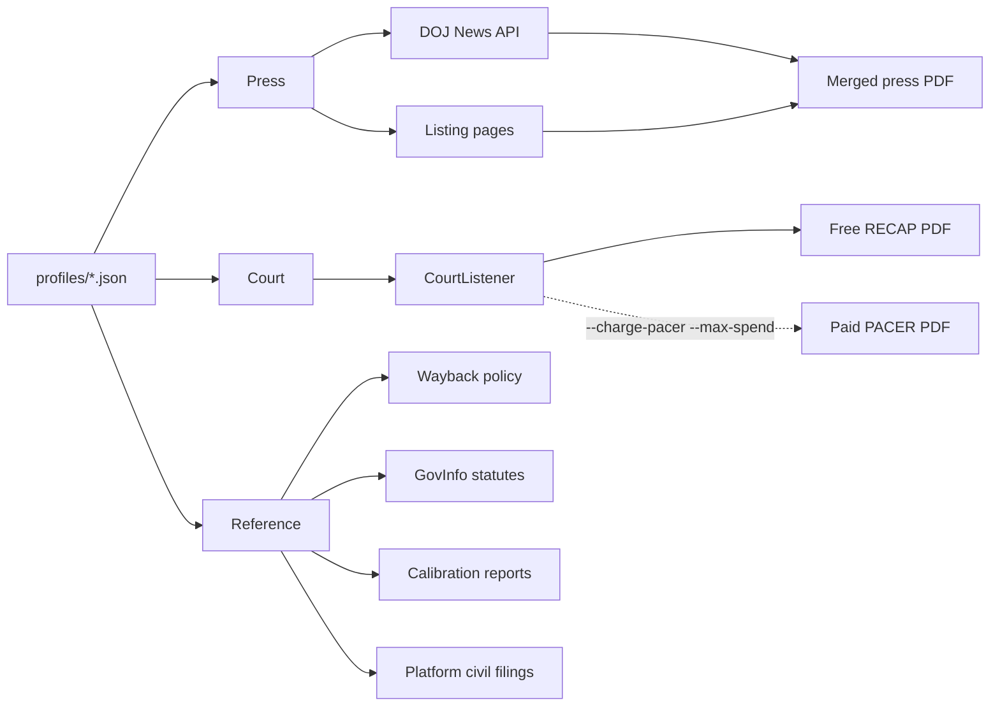

# Press, court, and reference records

Three collection paths, same rules. Public sources only. Outputs go to `data/collected/`. Nothing auto-ingests. NHSR **#8252**.

| Path | What it is | Where it writes |
|---|---|---|
| Press | DOJ, USAO, and agency releases | `data/collected/press_releases/` |
| Court | CourtListener search, free RECAP download. PACER only if you pay | `data/collected/recap/` and, when paid, `data/collected/PACER/` |
| Reference | Dated platform rules, statutes, calibration reports, platform civil filings | `data/collected/hyletic_data/` |

Profiles in `profiles/` point a path at a topic. Copy one to add a topic. Do not commit article text, PDFs, or tokens.



## Press

Discovery and PDF conversion are separate. A listing becomes a URL file. A topic with no URLs yet is a DOJ API harvest. A URL you already have is a resolve, then a PDF. `resolve_press_urls.py` looks up known `justice.gov` URLs. It does not search a topic.

`justice.gov` HTML is an Akamai wall. Use `https://www.justice.gov/api/v1/press_releases.json` (no key, about 3 requests a second). The API filters on title only.

| File | Role |
|---|---|
| `press_releases/harvest_doj_press.py` | Profile `title_terms` and `require` → resolved JSON |
| `press_releases/resolve_press_urls.py` | Known `justice.gov` URLs → API match. Other hosts: `mode: scrape` |
| `press_releases/fetch_source_urls.py` | HTML, Squarespace, Google CSE, search.usa.gov, WordPress REST |
| `press_releases/build_press_pdf.py` | One page per URL or resolved record, then a merged PDF |
| `press_releases/filter_merged_pdf.py` | Drop noise pages |
| `press_releases/remove_pdf_pages_by_text.py` | Drop pages by regex, exact text, or page list |
| `press_releases/check_expand_novelty.py` | Dedup a batch against an existing merged PDF |
| `run_bulk.py` | Press quota and a free-RECAP quota together |
| `run_source_bulk.py` | Phases `doj`, `agencies`, `pdf`, `recap` |
| `harvest_fraud_study.py` | Fraud press, state feeds, year-sweep of free RECAP |

Extractor detail: `press_releases/PRESS_RELEASE_COLLECTION.md`.

```bash
python3 collector/press_releases/harvest_doj_press.py \
  --profile fraud --max-keep 40 --limit-pages 2
python3 collector/press_releases/build_press_pdf.py \
  --doj-file collector/press_releases/sources/doj_fraud_resolved.json \
  --out-dir data/collected/press_releases/fraud --out-name FRAUD_batch.pdf
```

`--max-keep` stops after that many kept records. `--limit-pages` caps API pages per title term. Smoke-test a listing with `--limit 3`.

No `justice.gov` links in the list: `build_press_pdf.py --url-file`. A mixed list: `resolve_press_urls.py`, then `--doj-file`.

```bash
python3 collector/run_bulk.py --press-count 100 --court-count 5 \
  --domains fraud,trafficking,cyber,csea --out-dir data/collected
```

Scale on the CLI. A thousand records through MCP will time out.

Domain profiles: `fraud`, `trafficking`, `cyber`, `csea`, `forced_labor`, `ai`, `noesis`.

## Court

Search is CourtListener. Download is a filing already in free RECAP. PACER is the paid backup, CLI only, and only with `--charge-pacer` and `--max-spend`. `court_records.py` and `run_bulk.py` refuse PACER.

| File | Role |
|---|---|
| `court_records.py` | CourtListener search and free RECAP download. Refuses PACER and ECF |
| `press_to_recap.py` | Docket number in a press release → one CourtListener lookup → free PDF |
| `pacer/cases2records.py` | One docket. Free key docs by default. Buy only with a spend cap |
| `pacer/transcripts.py` | `sweep` is metadata. `fetch-free` is RECAP. `fetch --charge-pacer` buys |
| `pacer/corpus2pacer.py` | Corpus rows that look federal → a docket list |
| `pacer/pacer_cost.py` | Appends a row when a purchase is logged |

```bash
python3 collector/press_to_recap.py extract
python3 collector/press_to_recap.py pull --max-calls 180
python3 collector/pacer/transcripts.py sweep
python3 collector/pacer/transcripts.py fetch-free
```

`fetch` without `--download` is a dry run. Transcripts are $0.10 a page with no $3 cap. An unknown page count is refused. Sealed, restricted, and trial rows are refused on the paid path.

Free PDFs: `data/collected/recap/`. Paid PDFs: `data/collected/PACER/`. CourtListener token: `COURTLISTENER_API_TOKEN` in `.env`. Do not commit it.

## Reference records

Not a press release and not a criminal docket. Dated platform rules, the statutes those cases cite, public calibration reports, and civil complaints against platforms. One command, five subcommands. The module path is `collector.hyletic`.

```bash
python3 -m collector.hyletic wayback --limit 1 --snapshots 1
python3 -m collector.hyletic statutes --limit 1
python3 -m collector.hyletic calibration --limit 1
python3 -m collector.hyletic litigation --max-docs 1
python3 -m collector.hyletic seed --seeds collector/profiles/calibration.json
```

| Subcommand | What it collects | Profile | Output |
|---|---|---|---|
| `wayback` | A dated copy of a terms, guidelines, or safety page | `profiles/platform_policy.json` | `data/collected/hyletic_data/wayback/` |
| `statutes` | A U.S. Code section from GovInfo | `profiles/statutes.json` | `data/collected/hyletic_data/statutes/` |
| `calibration` | A public report (WeProtect, NCMEC statistics, CCRC). Not a raw case export | `profiles/calibration.json` | `data/collected/hyletic_data/calibration/` |
| `litigation` | One free RECAP filing on a platform civil query. No PACER | `profiles/platform_litigation.json` | `data/collected/hyletic_data/litigation/` |
| `seed` | Any URL list | a JSON file with a `documents` array | the `collection` name in that file |

Each object is the bytes plus `<filename>.provenance.json`: source URL, retrieval time, sha256. A re-run skips the file when the URL and the hash already match. If the bytes change, the file is replaced and the manifest keeps both hashes. `catalog_role` is a filing label, not an observed fact. These directories are gitignored.

`uscode.house.gov` currently redirects to a maintenance page, so statutes use GovInfo.

## Install

```bash
pip install requests beautifulsoup4 reportlab pypdf pdfplumber httpx
```

## A new topic

1. Copy the closest file in `profiles/`.
2. Press: `harvest_doj_press.py --profile <name>`, or `fetch_source_urls.py`, then `build_press_pdf.py`.
3. Court: put queries in `court_queries`. `run_bulk.py` and `press_to_recap.py` stay on free RECAP.
4. Reference: add a seed row and run the matching subcommand.
5. Ingest later, on purpose: `python3 src/main.py <pdf>`.

## When to stop and ask a human

- Login, CAPTCHA, or a paid API. PACER counts, unless `--charge-pacer` and `--max-spend` were set on purpose.
- robots.txt or terms block the scale you need.
- A JavaScript wall with no public API. For `justice.gov` HTML, use the News API.
