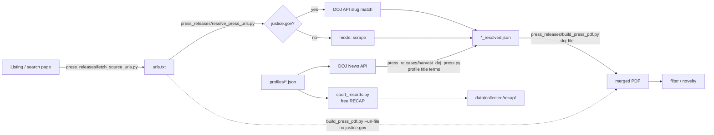

# Press, court, and source-packet collection

This directory collects public records for CaseNoesis: press releases, free court filings, and a small set of source packets (platform policy, litigation, statutes, calibration reports). Domain profiles decide the topic. The PDF engine does not.

Outputs land in `data/collected/`. Nothing here auto-ingests. Collection runs on your machine. NHSR **#8252**.

Extractor and DOJ API detail: `press_releases/PRESS_RELEASE_COLLECTION.md`. What is already on disk: `data/collected/README.md`.

## The pipeline, in one picture



Two splits:

1. **Discovery and PDF conversion are separate.** A listing becomes a URL file. A topic with no URLs yet is a DOJ API harvest. A URL you already have is a resolve, then a PDF.
2. **`resolve_press_urls.py` is a router, not a search.** It looks up known `justice.gov` URLs. It does not page a topic. Use `harvest_doj_press.py` for that. Skip resolve when the list has no `justice.gov` links.

## Suite map

| Path | Role |
|---|---|
| `press_releases/build_press_pdf.py` | One ReportLab page per URL or resolved record, then a merged PDF. Host extractors, Jina fallback, native PDF text. |
| `press_releases/harvest_doj_press.py` | DOJ News API discovery from a profile (`title_terms`, `require`, optional CAC gate). Emits resolved JSON. |
| `press_releases/resolve_press_urls.py` | Known `justice.gov` URLs → API match. Other hosts pass through as `mode: scrape`. |
| `press_releases/fetch_source_urls.py` | Listing pages: HTML, Squarespace, Google CSE, search.usa.gov, WordPress REST. |
| `press_releases/filter_merged_pdf.py` | Drop noise pages from a merged PDF. |
| `press_releases/remove_pdf_pages_by_text.py` | Drop pages by regex, exact-text dedupe, or a page list. |
| `press_releases/check_expand_novelty.py` | Dedup a new batch against an existing merged PDF. |
| `press_releases/sources/urls.txt` | Example URL list. |
| `profiles/*.json` | Topic terms for press and CourtListener. Copy one to point the same engine at a new topic. |
| `run_bulk.py` | Press quota plus free RECAP quota. Never purchases PACER. |
| `run_source_bulk.py` | DOJ, agency listings, press PDFs, then free RECAP. Phases: `doj`, `agencies`, `pdf`, `recap`. |
| `harvest_fraud_study.py` | Fraud press, state feeds, and a year-sweep of free RECAP. |
| `press_to_recap.py` | Docket number in a press release → one CourtListener lookup → free PDF if RECAP already has it. |
| `court_records.py` | Free RECAP search and download. Refuses PACER and ECF. |
| `pacer/` | Opt-in paid PACER. Cost log, key docs, transcripts. Writes `data/collected/PACER/`. |
| `hyletic/` | Policy snapshots, platform litigation, statutes, calibration reports, and a generic URL seed. |
| `press_releases/PRESS_RELEASE_COLLECTION.md` | Extractors, DOJ API quirks, when a host needs a special parser. |

Profiles today: `fraud`, `trafficking`, `cyber`, `csea`, `forced_labor`, `ai`, `noesis`.

## Install

```bash
pip install requests beautifulsoup4 reportlab pypdf pdfplumber httpx
```

Court downloads need a free CourtListener token in `.env` as `COURTLISTENER_API_TOKEN`. Do not commit it. A default token is about 5 requests a minute. Only filings already in RECAP can be downloaded. `run_bulk.py` never purchases PACER.

## Quickstart

Run from the repo root.

### A topic, no URL list yet

```bash
python3 collector/press_releases/harvest_doj_press.py \
  --profile fraud --max-keep 40 --limit-pages 2
python3 collector/press_releases/build_press_pdf.py \
  --doj-file collector/press_releases/sources/doj_fraud_resolved.json \
  --out-dir data/collected/press_releases/fraud --out-name FRAUD_batch.pdf
```

`--max-keep` stops after that many kept records. `--limit-pages` caps API pages per title term. CSEA may run the CAC check. Other profiles set `skip_cac`.

Do not crawl `justice.gov` HTML. The News API is `https://www.justice.gov/api/v1/press_releases.json` (no key, about 3 requests a second). It filters on title only.

### URLs you already have

No `justice.gov` links:

```bash
python3 collector/press_releases/build_press_pdf.py \
  --url-file collector/press_releases/sources/urls.txt \
  --out-dir data/collected/press_releases/fraud --out-name BATCH.pdf --jina-fallback
```

A list that might include `justice.gov`:

```bash
python3 collector/press_releases/resolve_press_urls.py \
  --url-file collector/press_releases/sources/urls.txt \
  --out collector/press_releases/sources/urls_resolved.json
python3 collector/press_releases/build_press_pdf.py \
  --doj-file collector/press_releases/sources/urls_resolved.json \
  --out-dir data/collected/press_releases/fraud --out-name BATCH.pdf
```

### A listing page, no article URLs yet

```bash
python3 collector/press_releases/fetch_source_urls.py \
  --url 'https://www.example.gov/search?q=trafficking' \
  --same-host --path-prefix /news/ \
  --require-any trafficking \
  --exclude /search --exclude /tag/ \
  -o collector/press_releases/sources/example_urls.txt
```

Smoke-test with `--limit 3` before a long list.

### Press and free court together

```bash
python3 collector/run_bulk.py --press-count 100 --court-count 5 \
  --domains fraud,trafficking,cyber,csea \
  --out-dir data/collected
```

Scale on the CLI. Do not send a thousand records through MCP. The client times out.

```bash
python3 collector/run_bulk.py --press-count 1000 --court-count 50 \
  --domains fraud,trafficking,cyber,csea \
  --out-dir data/collected
```

## Why DOJ is different

`justice.gov` sits behind an Akamai challenge. Direct fetches get a shell, not the article. Use the News API.

| You have | Tool |
|---|---|
| A profile or title terms, no URLs | `harvest_doj_press.py` → `--doj-file` |
| A list of `justice.gov` URLs | `resolve_press_urls.py` → `--doj-file` |
| Only other hosts | `build_press_pdf.py --url-file` |

## Court records

Free first. Paid only on the CLI, with a dollar cap.

```bash
python3 collector/press_to_recap.py extract
python3 collector/press_to_recap.py pull --max-calls 180
python3 collector/pacer/transcripts.py sweep
python3 collector/pacer/transcripts.py fetch-free
```

`transcripts.py fetch` without `--download` is a dry run. Buying needs `--charge-pacer` and `--max-spend`. Transcripts are $0.10 a page with no $3 cap. An unknown page count is refused. Sealed, restricted, and trial rows are refused on the paid path.

Free PDFs go to `data/collected/recap/`. Paid filings go to `data/collected/PACER/`. Neither is ingested.

## Hyletic

Source packets that are not a press PDF and not the fraud-study court set. One command.

```bash
python3 -m collector.hyletic wayback --limit 1 --snapshots 1
python3 -m collector.hyletic litigation --max-docs 1
python3 -m collector.hyletic statutes --limit 1
python3 -m collector.hyletic calibration --limit 1
python3 -m collector.hyletic seed --seeds collector/profiles/calibration.json
```

| Subcommand | Profile | Output |
|---|---|---|
| `wayback` | `profiles/platform_policy.json` | `data/collected/hyletic_data/wayback/` |
| `litigation` | `profiles/platform_litigation.json` | `data/collected/hyletic_data/litigation/` |
| `statutes` | `profiles/statutes.json` | `data/collected/hyletic_data/statutes/` |
| `calibration` | `profiles/calibration.json` | `data/collected/hyletic_data/calibration/` |
| `seed` | any JSON file with a `documents` list | the `collection` name in that file |

Each object is the bytes plus a `.provenance.json` sidecar: source URL, retrieval time, sha256. `catalog_role` is a filing label, not an observed fact. Litigation is free RECAP only. Statutes come from GovInfo. Calibration seeds are public reports, not raw case exports. These directories are gitignored.

## Output

`build_press_pdf.py` writes one PDF per URL under `{out-dir}/tmp/`, then merges them. The cache key is a hash of the URL. Delete `tmp/` to force a refetch.

Press text, court PDFs, and hyletic captures stay on the machine. Commit URL indexes and profiles. Do not commit article bodies or PDFs.

## A new topic

1. Copy `profiles/fraud.json`. Set `title_terms`, `require`, and `court_queries`.
2. Discover with `harvest_doj_press.py --profile <name>`, or harvest a listing with `fetch_source_urls.py`.
3. Build with `build_press_pdf.py`.
4. Novelty-check with `check_expand_novelty.py` before appending to a merged PDF.
5. Ingest later, on purpose: `python3 src/main.py <pdf>`.

## When to stop and ask a human

- Login, CAPTCHA, or a paid API, including PACER, unless a spend cap was set on purpose.
- robots.txt or terms block the scale you need.
- A JavaScript bot-wall with no public API. That is the `justice.gov` HTML case. Use the API instead of solving the wall.
